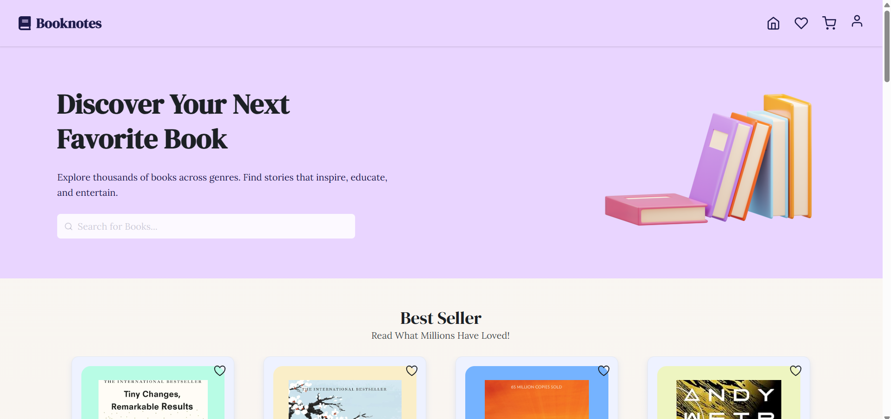
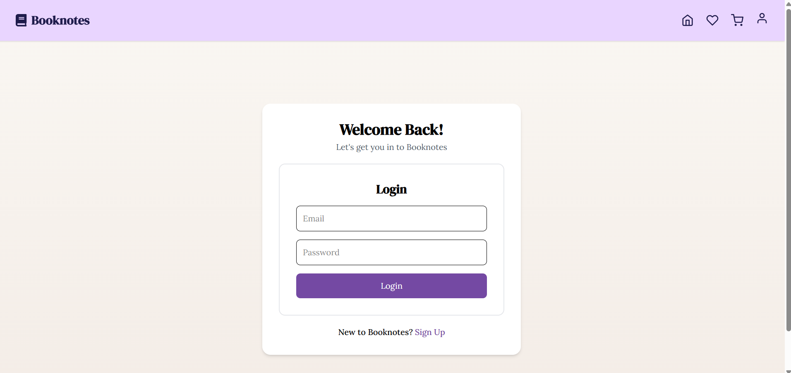
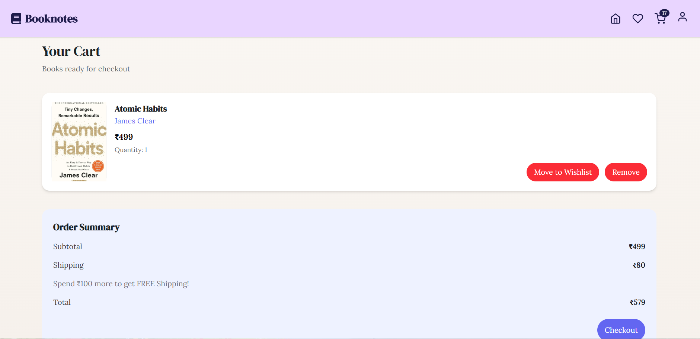
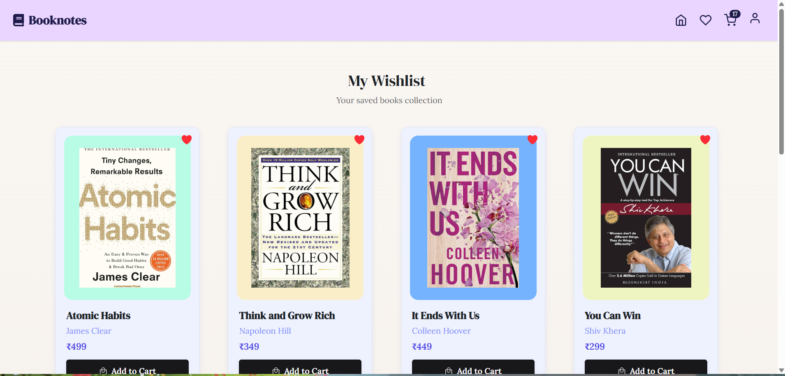
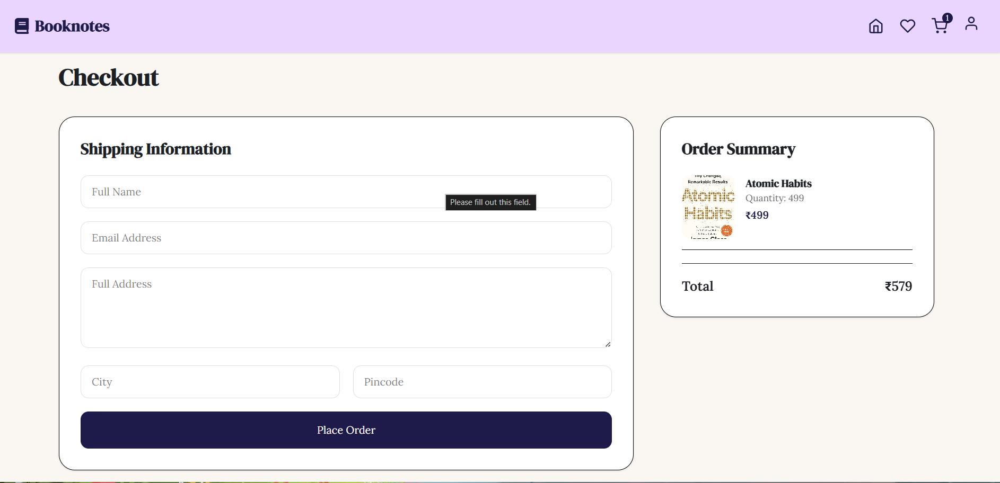

# 📚 Booknotes — MERN Bookstore Ecommerce Website

Booknotes is a full-stack MERN bookstore ecommerce website where users can browse books, search for books, add them to cart or wishlist, and place orders.

I built this project to practice full-stack development, API integration, authentication, and responsive UI design using the MERN stack.

## ✨ Features

- User authentication (Login / Signup)
- Browse books by category
- Search books
- Book details page
- Add to cart and wishlist
- Checkout functionality
- Order placement
- Responsive design for mobile, tablet, and desktop

## 🛠️ Tech Stack

### Frontend
- React.js
- Vite
- Tailwind CSS
- Axios
- React Router DOM
- React Toastify
- Swiper.js

### Backend
- Node.js
- Express.js
- MongoDB
- Mongoose
- JWT Authentication

## 📂 Project Structure

```txt
booknotes-mern/
├── frontend/
├── backend/
├── .gitignore
└── README.md
```

## 🚀 Installation & Setup

Clone the repository:

```bash
git clone <repo-link>
cd booknotes-mern
```

Install dependencies:

### Frontend

```bash
cd frontend
npm install
```

### Backend

```bash
cd backend
npm install
```

## 🔐 Environment Variables

Create a `.env` file inside the backend folder:

```env
MONGO_URI=your_mongodb_connection_string
JWT_SECRET=your_secret_key
PORT=5000
```

Create a `.env` file inside the frontend folder:

```env
VITE_API_URL=http://localhost:5000/api
```

## ▶️ Run Locally

Start backend:

```bash
cd backend
npm run dev
```

Start frontend:

```bash
cd frontend
npm run dev
```

## 📸 Screenshots

### Home Page



### Login Page



### Cart Page



### Wishlist Page



### Checkout Page



## 🔮 Future Improvements

- Payment integration
- Admin dashboard improvements
- Reviews and ratings
- Pagination
- Better error handling

## 👩‍💻 Author

Built by Isha Thapa as a MERN stack learning project.